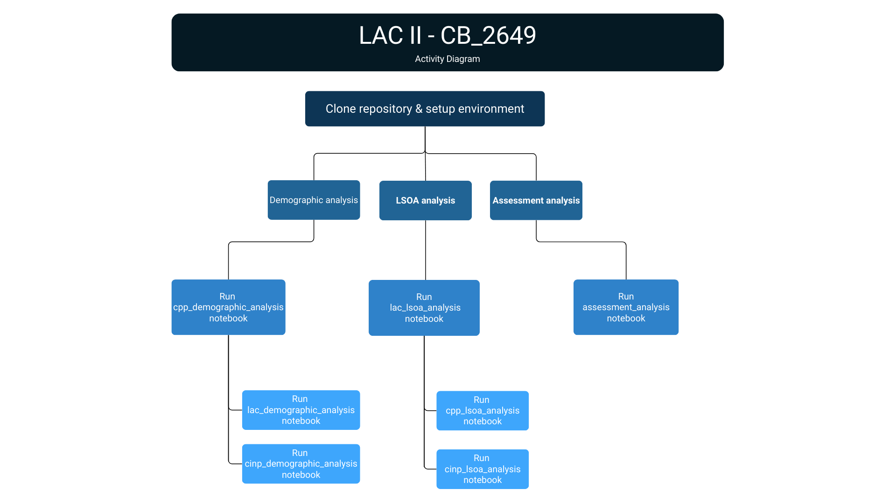

<h1 align="center">CB_2649 - LAC II 2024/2025</h1>
<hr style="height:3px;border-width:0;color:gray;background-color:gray">


## Table of Contents
---
- [Overview](#Overview)
- [Project Structure](#Project-Structure)
- [Data Sources](#Data-Sources)
- [Workflow Diagram](#Workflow-Diagram)
- [Reproduction Steps](#Reproduction-Steps)
      - [Environment Setup](#Environment-Setup)
      - [Running the Analysis](#Running-the-Analysis)
    - [Demographic Analysis](#Demographic-Analysis)
    - [LSOA-Level Analysis](#LSOA-Level-Analysis)
    - [Comprehensive Assessment](#Comprehensive-Assessment)
- [Key Modules](#Key-Modules)
- [License](License)
---
## Overview
This project analyzes three social care interventions in Bradford:
- Child Protection Plans (CPP)
- Looked After Children (LAC)
- Children in Need Plans (CINP)

The analysis examines both demographic patterns and geographical distribution at Lower Super Output Area (LSOA) level.

## Project Structure
```
.
├── code/               # Reusable modules for analysis
├── data/               # Input datasets
├── docs/               # Documentation
├── figs/               # Generated visualizations
├── notebooks/          # Analysis notebooks     
└── requirements.txt    # Dependencies
```

## Data Sources
- Bradford boundary data (LSOA level) - [LINK](https://borders.ukdataservice.ac.uk/)
- English Index of Multiple Deprivation (IMD) 2019 - [LINK](https://data.cdrc.ac.uk/dataset/index-multiple-deprivation-imd)
- Bradford children population data (0-17, 2021) - [LINK](https://www.ons.gov.uk/peoplepopulationandcommunity/populationandmigration/populationestimates/datasets/lowersuperoutputareamidyearpopulationestimates)
- Children's social care data (CPP, LAC, CINP) - Connected Bradford

## Workflow Diagram
This diagram provides an overview of the analysis workflow:



## Reproduction Steps

### Environment Setup
1. Clone this repository and navigate to the project folder:

```bash
git clone https://github.com/ConnectedBradford/CB_2649
cd CB_2649
```

2. Create and activate a virtual environment:

```bash
# For Windows
python -m venv venv
venv\Scripts\activate

# For Mac/Linux
python -m venv venv
source venv/bin/activate
```

3. Install dependencies:

```bash
pip install -r requirements.txt
```

### Running the Analysis

#### Demographic Analysis
The demographic analysis workflow:
1. Run the initial CPP analysis:
   ```bash
   jupyter notebook notebooks/cpp_demographic_analysis.ipynb
   ```
2. The LAC and CINP demographic analyses reuse modules from the CPP analysis:
   ```bash
   jupyter notebook notebooks/lac_demographic_analysis.ipynb
   jupyter notebook notebooks/cinp_demographic_analysis.ipynb
   ```

#### LSOA-Level Analysis
The LSOA analysis workflow:
1. Run the initial LAC analysis:
   ```bash
   jupyter notebook notebooks/lac_lsoa_analysis.ipynb
   ```
2. The CPP and CINP LSOA analyses reuse modules from the LAC analysis:
   ```bash
   jupyter notebook notebooks/cpp_lsoa_analysis.ipynb
   jupyter notebook notebooks/cinp_lsoa_analysis.ipynb
   ```

#### Comprehensive Assessment
For a combined analysis of assessment across interventions:
```bash
jupyter notebook notebooks/assessment_analysis.ipynb
```

## Key Modules
- `data_cleaning.py`: Data preparation and standardization
- `analysis_helpers.py`: Analysis functions for demographic analysis
- `lsoa_analysis_helper.py`: Geospatial analysis functions for LSOA-level analysis


## 7. License
See the LICENSE file for details.
